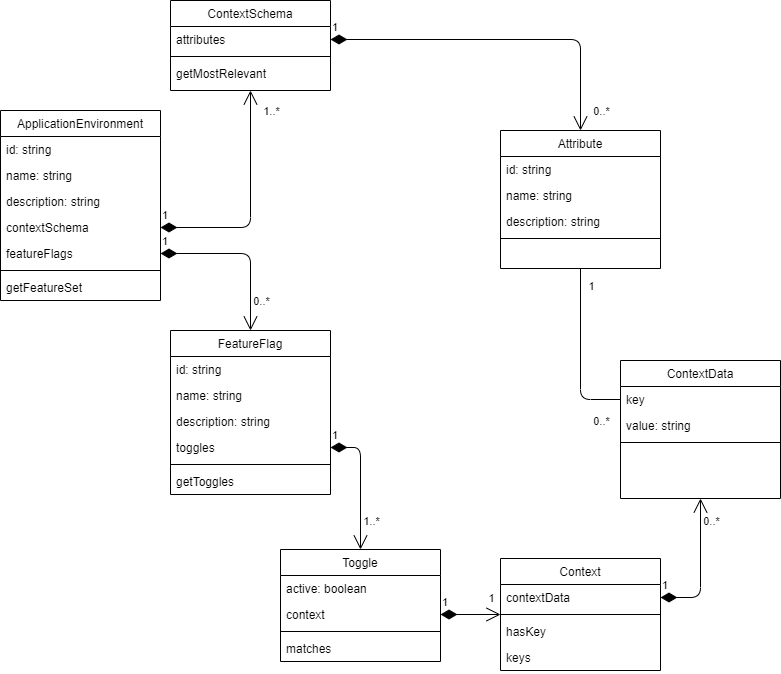

.. image:: images/Tikked.png
   :height: 300px

Welcome to Tikked's documentation!
===========================================

Terms
---------------------------------------
- Application Environment: A container for a collection of related feature flags and their configuration
- Context Schema: A schema for how contexts can be defined in the related Feature Flags
- Feature Flag: A reference to a specific feature, which clients want to know the status of (active/inactive)
- Toggle: A flag used to indicate whether a feature is available or not for given context

